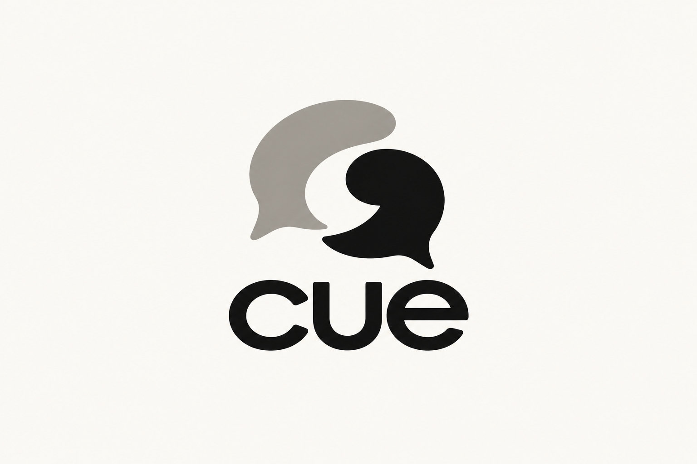

# Cue Design System

> **Purpose:** Canonical visual and interaction design guidance for Cue. Product, brand, UI, marketing, industrial-design, and image-generation work should follow this file together with [`CUE_CONTEXT.md`](./CUE_CONTEXT.md).
>
> **Status:** Direction approved; production artwork remains to be drawn and validated.  
> **Last updated:** 2026-10-05 (five haptic cues, the 3D device view, and dark-mode app tokens synced with `CUE_CONTEXT.md` §26; see §25)

## Contents

1. Design idea and decision status
2. Primary logo anatomy and construction
3. Responsive logo variants and applications
4. Clear space, sizing, and misuse
5. Color system
6. Typography and type scale
7. Layout, iconography, motion, and UI
8. Hardware, photography, and illustration
9. Brand voice and accessibility
10. Asset generation, review, and production handoff

## 1. Design idea

Cue helps people create space in conversation. The identity should communicate:

> **Two voices create a deliberate moment of space.**

The visual system is built around two interlocking conversational forms. They first read as an exchange between people; their shared negative space then reveals a subtle `C` and a pause. This second discovery makes the mark more memorable without requiring the logo to explain the whole product.

Cue should feel:

- Calm, not passive.
- Confident, not corrective.
- Young, not childish.
- Premium, not luxurious for its own sake.
- Human, not clinical.
- Technological, not futuristic theater.
- Supportive, not judgmental.

## 2. Decision-status legend

- **[APPROVED DIRECTION]** Preserve this unless a human owner explicitly changes it.
- **[PROVISIONAL]** Current recommendation that requires validation or production refinement.
- **[OPEN]** Unresolved; do not silently present it as final.

## 3. Primary logo



### Approved construction

- **[APPROVED DIRECTION]** The primary lockup uses one compact symbol above a lowercase `cue` wordmark.
- **[APPROVED DIRECTION]** The symbol contains exactly two interlocking abstract conversation forms.
- **[APPROVED DIRECTION]** One form is near-black and one is warm gray.
- **[APPROVED DIRECTION]** The shared negative space should suggest both a `C` and an intentional pause.
- **[APPROVED DIRECTION]** The wordmark is lowercase, soft-geometric, and confident.
- **[APPROVED DIRECTION]** The core logo does not need radio waves, a microphone, an ear, a face, quotation marks, or an explicit pause-button glyph.

### Logo anatomy and meaning

The mark has four intentional parts. Use these names consistently in design reviews and production files:

1. **The first voice** — the warm-gray upper-left form. It represents the surrounding conversation, another speaker, and the social context in which Cue is used.
2. **The wearer voice** — the near-black lower-right form. It represents the Cue wearer and receives greater visual weight.
3. **The space** — the warm-white channel between the forms. It is the most important conceptual element: a pause, a breath, and the hidden `C`.
4. **The wordmark** — the custom lowercase `cue`. It gives the abstract symbol a clear name and keeps the brand approachable.

The forms are not literal speech bubbles. Their tails should be reduced enough that the silhouette feels proprietary, but retained enough that a viewer can still infer conversation without reading an explanation.

### Geometric principles

The final vector construction should follow these principles rather than tracing the generated pixels:

- Build both voices from related curves so they feel like parts of one system.
- The first voice is slightly larger and lighter; the wearer voice is slightly smaller and optically heavier.
- Neither form should appear to sit entirely in front of the other. The relationship is exchange, not dominance.
- The space must remain open at small sizes and should read as a `C` through silhouette rather than an outlined letter.
- Tails should point into the shared conversational field, not away from the composition.
- Avoid perfect mirrored symmetry. Controlled asymmetry makes the exchange feel human and prevents a generic yin-yang reading.
- Avoid perfect circles. Slightly flattened, speech-like volumes create a more ownable silhouette.
- The combined symbol should fit within an approximately square bounding box for app-icon and product-marking use.
- No curve should create a sharp cusp that fills in during laser marking or low-resolution rendering.

### Symbol-to-wordmark relationship

**[PROVISIONAL]** Until final vectors are drawn, use these proportional targets:

- In the stacked lockup, symbol width is approximately **1.15–1.3×** wordmark width.
- The gap between symbol and wordmark is approximately **0.6x**, where `x` is the wordmark’s lowercase height.
- Center the symbol optically over the wordmark, not mechanically. The darker wearer voice may require a slight leftward optical correction.
- In the horizontal lockup, symbol height is approximately **1.15×** wordmark cap/lowercase height.
- The horizontal gap is approximately **0.5x**.
- The symbol and wordmark must never overlap.

### Wordmark letterforms

The wordmark is custom artwork, not typed text. Its intended forms are:

- **`c`** — open and nearly circular, with terminals that echo the opening in the symbol without copying it exactly.
- **`u`** — stable and generous, with vertical sides and a smooth lower bowl. It acts as the visual anchor.
- **`e`** — open counter and horizontal crossbar, tuned to remain legible at tiny sizes.
- Stroke weight should be visually even across all three letters.
- Corners may be subtly softened, but must not become inflated or toy-like.
- Kerning should make `cu` and `ue` feel equally calm; the wordmark must not look mechanically tracked.
- Do not append a period to the formal wordmark. `Cue.` may appear as campaign typography, but it is not the logo.

### Production-artwork warning

The included PNG is the **approved concept direction**, not production master artwork. Before commercial use, a designer must redraw it as precise vector geometry and complete:

1. Optical correction of both conversational forms.
2. Exact negative-space construction.
3. Custom wordmark drawing and kerning.
4. Small-size testing at 16, 24, and 32 pixels.
5. Single-color and reverse-color versions.
6. Engraving, embossing, and laser-marking tests.
7. Trademark similarity review.

Do not auto-trace the PNG and treat the result as final vector artwork.

## 4. Logo variants

The eventual production package should contain:

- `cue-lockup-stacked` — symbol above wordmark; primary brand lockup.
- `cue-lockup-horizontal` — symbol left of wordmark; wide layouts.
- `cue-symbol` — app icon, social avatar, product engraving, favicon.
- `cue-wordmark` — constrained spaces where the symbol is already present.
- `cue-logo-one-color-dark` — near-black on a light background.
- `cue-logo-one-color-light` — warm white on a dark background.

No variant should introduce new decorative elements.

### Responsive logo system

Use the simplest form that remains clear at the available size:

| Tier | Asset | Typical use | Rule |
|---|---|---|---|
| 1 | Full stacked lockup | Launch screens, packaging front, campaign end cards | Default when vertical space is available |
| 2 | Full horizontal lockup | Navigation, documents, retail strips | Default for wide, shallow spaces |
| 3 | Wordmark only | Small navigation, product UI already carrying the symbol | Use only when brand context is established |
| 4 | Symbol only | App icon, avatar, favicon, BTE device, case | Use where `cue` would be illegible or redundant |
| 5 | Micro symbol | 16–23 px interfaces, very small marking | Use a separately optically simplified master |

Do not merely scale the full stacked lockup down into Tier 4 or Tier 5 contexts.

### Logo forms by background

#### Full-color light

- Near-black wearer voice.
- Warm-gray first voice.
- Near-black wordmark.
- Bone or white background.
- This is the default brand signature.

#### Full-color dark

- Warm-white wearer voice.
- Light warm-gray first voice.
- Warm-white wordmark.
- Ink background.
- Redraw/recolor intentionally; do not apply an automatic photographic negative filter.

#### One-color dark

- Entire mark in near-black on white, bone, or a sufficiently light neutral.
- Preserve the separation through negative space.
- Preferred for documents, embossing masters, and economical printing.

#### One-color light

- Entire mark in warm white on ink or a sufficiently dark solid field.
- Preferred for dark hardware, dark packaging, and reverse applications.

#### Material mark

- Deboss, emboss, laser etch, or polish the symbol as one material treatment.
- Do not attempt to reproduce the two-tone concept when the process cannot hold reliable contrast.
- Test the negative-space channel before finalizing tool paths.

### App icon

- Use the symbol only; never fit the wordmark inside the icon.
- Center optically with at least 14% clear space on every side.
- Use a bone field with near-black/warm-gray forms for the default light icon.
- Use an ink field with warm-white/light-gray forms for dark mode.
- Do not add a rounded-square container inside the operating system’s icon mask.
- Avoid accent dots, notification-like badges, and signal waves in the master app icon.
- Provide separate assets for iOS, Android adaptive foreground/background, web app manifest, and social avatar use.

### Favicon and micro mark

- Use the optically simplified symbol.
- Increase the negative-space channel slightly at 16 px.
- Remove any tail detail that collapses below one device pixel.
- Test at 16, 20, 24, and 32 px on both light and dark browser chrome.

### Social avatar

- Use the symbol only on a solid bone or ink field.
- Keep important geometry within the central 70% safe region to survive circular cropping.
- Do not use photographs behind the avatar logo.

### Product marking

- Use the standalone symbol on the device whenever physically possible.
- Use the wordmark or horizontal lockup on the charging case.
- Minimum physical dimensions depend on process testing; never shrink because a render “looks fine.”
- Use engraving or surface contrast that remains discreet. The product should not become a billboard.

### Co-branding

- Separate Cue from a partner logo with a thin neutral rule or at least `2x` clear space.
- Match optical height, not raw bounding-box height.
- Never combine marks into a new shared symbol.
- Cue’s logo should remain in its approved colors unless a one-color sponsorship environment requires otherwise.
- Do not let a partner tagline appear closer to Cue than Cue’s own clear-space requirement.

### Placement

- Preferred placement is top-left for functional documents and centered for brand moments.
- Bottom-left is acceptable on photography when contrast is controlled.
- Avoid top-right placement near account or navigation controls, where the mark can look like a button.
- Do not place the mark on the wearer’s face or directly over the device in lifestyle photography.
- When placed over imagery, use a calm solid-color holding field or choose an area with verified contrast.

## 5. Clear space and minimum size

### Clear space

**[PROVISIONAL]** Define `x` as the stroke/vertical thickness of the lowercase `u` in the final wordmark.

- Keep at least `1.5x` clear space around the full lockup.
- Keep at least `1x` around the standalone symbol.
- Product engraving may use reduced clear space only after physical testing.

### Minimum size

- Standalone symbol: **16 px** digital minimum, subject to final optical testing.
- Full horizontal lockup: **96 px** wide digital minimum.
- Full stacked lockup: **72 px** wide digital minimum.
- Physical symbol: **6 mm** wide minimum unless manufacturing tests prove a smaller size remains clear.

If the hidden `C` closes up or the conversational forms merge, use a simplified small-size master rather than adding outlines.

## 6. Logo misuse

Never:

- Stretch, skew, rotate, or redraw the logo casually.
- Separate or rearrange the two conversational forms.
- Add more speech bubbles or signal waves.
- Add gradients, bevels, chrome, glow, drop shadows, or glass effects to the core mark.
- Place the logo inside a generic chat bubble.
- Use the symbol as a repeating decorative pattern without explicit brand approval.
- Replace the wordmark with an arbitrary rounded font.
- Use low-contrast gray-on-gray combinations.
- Place the detailed lockup on visually busy photography.
- Describe the generated concept PNG as finished vector artwork.

## 7. Color system

### Core palette

| Token | Hex | Use |
|---|---:|---|
| `ink-950` | `#111111` | Primary text, primary logo form, dark UI |
| `warm-gray-500` | `#9F9A93` | Secondary logo form, supporting neutral |
| `bone-50` | `#F7F4EE` | Primary light background |
| `white` | `#FFFFFF` | High-clarity surfaces and reverse space |

### Supporting neutrals

| Token | Hex | Use |
|---|---:|---|
| `stone-100` | `#EEEAE3` | Cards and subtle sections |
| `stone-300` | `#D5D0C8` | Borders and disabled surfaces |
| `stone-700` | `#5F5B56` | Secondary text on light backgrounds |
| `ink-800` | `#282725` | Elevated dark surfaces |

### Accent palette

**[PROVISIONAL]** Use only one primary accent family in a given composition.

| Token | Hex | Character | Recommended use |
|---|---:|---|---|
| `signal-cobalt` | `#2437D8` | Clear, capable, digital | Links, selected states, restrained campaign accent |
| `signal-oxblood` | `#7A1E2C` | Mature, editorial, assured | Special brand moments and premium packaging |
| `signal-chartreuse` | `#B7E533` | Energetic, visible, youthful | Tiny hardware/UI signal only; never large backgrounds |

Default recommendation: start with **cobalt** for product UI. Keep oxblood and chartreuse as controlled campaign or colorway accents until brand testing identifies a clear preference.

### Color rules

- The primary identity is neutral; accents support it rather than define it.
- Accent should normally occupy less than 10% of a composition.
- Never apply all three accents simultaneously.
- Do not use pastel rainbow gradients as shorthand for Gen Z.
- Meet WCAG contrast requirements for functional text and controls.
- **[PROVISIONAL]** In the product app, cobalt marks coaching cues and selected state only. Meters, touch-control confirmations, and corrections stay neutral (ink / stone / warm gray). In dark mode cobalt is lifted (`#8C9BFF`) to keep contrast on ink surfaces; validate with the brand team.
- **[PROVISIONAL]** Dark-mode app tokens (`src/app/globals.css`), alongside `ink-950` background, `ink-800` surface and `bone-50` text:

  | App token | Hex | Use |
  |---|---:|---|
  | `--surface-2` | `#33312E` | Secondary surfaces on ink |
  | `--line` | `#48453F` | Borders and dividers |
  | `--muted` | `#B9B4AC` | Secondary text (warm gray, lifted) |
  | `--neutral` | `#C9C4BC` | Meters and confirmations (non-accent emphasis) |
  | `--cue` | `#8C9BFF` | Coaching cues and selected state (cobalt, lifted) |
- Warm gray is not suitable for small text on bone without a contrast check.

## 8. Typography

### Wordmark

- **[APPROVED DIRECTION]** The wordmark is a custom lowercase `cue` drawing.
- It should have soft geometric construction without becoming bubbly.
- Counters should remain open at small sizes.
- The `c`, `u`, and `e` should share a clear stroke logic and rhythm.
- The wordmark should look calm and stable, not fast, italic, or kinetic.

### Font families

The current product already ships with **Geist Sans** and **Geist Mono**. The brand system should build from that implementation instead of introducing Inter by default.

#### Primary family — Geist Sans

Use for:

- Product UI.
- Marketing headlines and body copy.
- Packaging information.
- Presentations and internal documents.
- Data labels and metric summaries.

Recommended weights:

| Weight | Name | Use |
|---:|---|---|
| 400 | Regular | Body copy, descriptions, secondary UI |
| 500 | Medium | Buttons, labels, navigation, emphasized body copy |
| 600 | Semibold | Headlines, key metrics, short campaign statements |
| 700 | Bold | Rare, high-impact display use only |

Avoid 100–300 weights in functional UI; they lose clarity at small sizes and conflict with the confident brand tone.

#### Technical family — Geist Mono

Use only for:

- Developer-facing diagnostics.
- Model/version identifiers.
- Timecodes and transcription timestamps.
- Tabular technical readouts where monospace alignment is useful.

Do not use Geist Mono as a decorative “tech” signal in consumer marketing.

#### Wordmark family — custom artwork

The `cue` wordmark is not Geist Sans and should never be reconstructed by typing the name in Geist. Use an approved vector wordmark file.

#### Fallback stacks

```css
--font-brand-sans: "Geist", "Helvetica Neue", Arial, sans-serif;
--font-brand-mono: "Geist Mono", "SFMono-Regular", Consolas, monospace;
```

Applications that cannot load Geist should use the complete fallback stack rather than substituting an arbitrary rounded typeface.

### Type scale

Use this as the default responsive product scale. Marketing surfaces may extend beyond it while preserving the same ratios and line-height discipline.

| Token | Desktop size/line | Mobile size/line | Weight | Typical use |
|---|---:|---:|---:|---|
| `display-xl` | 72/72 px | 48/50 px | 600 | Hero statement |
| `display-lg` | 56/58 px | 40/42 px | 600 | Campaign or landing-page headline |
| `heading-1` | 40/44 px | 32/36 px | 600 | Page title |
| `heading-2` | 32/38 px | 26/32 px | 600 | Major section |
| `heading-3` | 24/30 px | 22/28 px | 600 | Card group or subsection |
| `title` | 20/26 px | 18/24 px | 500 | Card title, modal title |
| `body-lg` | 18/28 px | 17/27 px | 400 | Lead copy |
| `body` | 16/24 px | 16/24 px | 400 | Default reading text |
| `body-sm` | 14/20 px | 14/20 px | 400 | Secondary information |
| `label` | 13/16 px | 13/16 px | 500 | Controls and compact labels |
| `caption` | 12/16 px | 12/16 px | 400 | Metadata and qualifiers |

Do not set essential consumer text below 12 px.

### Tracking

- Display headlines: `-0.03em` to `-0.015em`, adjusted optically.
- Headings: `-0.02em` to `-0.01em`.
- Body: `-0.005em` to `0`.
- Buttons and labels: `0` to `0.01em`.
- Short all-caps labels: `0.06em` to `0.1em`.
- Never apply wide tracking to paragraph text.

### Line length and paragraph rhythm

- Product body copy: target 45–70 characters per line.
- Editorial/marketing copy: target 45–65 characters per line.
- Use one full line of whitespace between distinct thoughts rather than dense paragraph blocks.
- Paragraph spacing should be approximately `0.75–1×` the body line height.
- Do not center-align paragraphs longer than three short lines.

### Numerals and data

- Use tabular numerals for aligned tables, timers, rates, and comparison cards.
- Use proportional numerals in ordinary prose.
- Use the true multiplication sign `×`, en dash for ranges, and proper curly apostrophes in polished marketing copy.
- Keep units attached to values where possible: `3.2 fillers/min`, `620 ms`, `14 min`.
- Never imply false precision. Round metrics to the resolution the system can actually support.

### Headline forms

Cue headlines should be short and leave conceptual space. Recommended structures:

- Imperative: “Make space.”
- Contrast: “Fewer fillers. More you.”
- Outcome: “Speak with intention.”
- Observation: “Your pauses felt steadier today.”

Avoid multi-line word art, arbitrary line breaks inside phrases, and excessive punctuation.

### Typography rules

- Prefer sentence case.
- Use lowercase selectively in brand headlines, not as an inflexible system.
- Avoid excessive all-caps; reserve it for short labels.
- Avoid ultra-light weights that disappear on mobile screens.
- Avoid childish rounded fonts, tech-mono clichés, and high-fashion serifs in core UI.
- Keep line length near 45–75 characters for reading surfaces.
- Use no more than three type sizes in a compact interface region.
- Use bold sparingly; hierarchy should come primarily from size, placement, and whitespace.
- Use italics only for natural editorial emphasis, never for whole interface labels.
- Underline only links.
- Do not mimic the logo by setting all brand copy in rounded lowercase.
- Keep `Cue` capitalized in prose and `cue` lowercase only when displaying the formal wordmark or a deliberately styled campaign lockup.

## 9. Spacing and layout

Cue’s layout should visually model good speaking: clear rhythm, intentional pauses, and room to breathe.

### Grid

- Use a base spacing unit of **4 px**.
- Primary spacing steps: `4, 8, 12, 16, 24, 32, 48, 64, 96`.
- Use 8 px increments for ordinary UI layout.
- Use generous 48–96 px pauses between major marketing sections.
- Align to a clear grid; avoid scattered “playful” placement.

### Shape language

- Corners are softly controlled, not pill-shaped by default.
- Suggested interface radii: 8 px for controls, 12–16 px for cards, full-circle only for compact status elements.
- Prefer large calm fields and a few deliberate overlaps.
- Use the logo’s interlocking idea sparingly in layouts; do not turn every card into a speech bubble.

## 10. Iconography

- Use simple, optically balanced line icons with rounded joins.
- Default icon grid: 24 px.
- Default stroke: 1.75–2 px depending on rendering.
- Icons should describe actions directly; do not make users learn a symbolic brand language for basic controls.
- Haptic, pace, pause, privacy, and self-caught icons should share one construction system.
- Avoid mixing filled emoji-like icons with technical outlines.
- Do not reuse the Cue symbol for unrelated functions.

## 11. Motion and haptics

Motion should feel like a breath or a gentle cue—not an alarm.

- Use short ease-out transitions for immediate state changes: approximately 160–220 ms.
- Use slower 300–450 ms transitions for expanding reflections or progress views.
- Avoid bouncing, shaking, flashing, or celebratory confetti for filler reduction.
- Respect reduced-motion settings.
- Visual feedback for a cue may use one subtle outward movement or brief pause in motion. In the app, each haptic is drawn where it happens: **rings leave the motor** on the 3D device in the cue's rhythm, and the motor glows while it is driven. No shaking, jitter, or flashing.
- **[PROVISIONAL — owner decision 18, 2026-10-10, see `CUE_CONTEXT.md` §5 and §26]** Three coaching cues, distinguished by rhythm, not strength. Every cue starts with a sharp onset.

  | Cue | Haptic | When |
  |---|---|---|
  | Pause | One tap | No pause, a long turn, or a filler pattern |
  | Slow down | Slow steps (three pulses) | Rushing |
  | Speak up | Long push | Too quiet |
- **Touch-control confirmations** (long press = Cue on/off, double tap = Conversation/Presentation mode) are **ramps**: a vibration that swells or fades with no sharp onset, shown on the device as a **neutral glow with no rings**, so they can't be mistaken for coaching. Rising = on / Conversation, falling = off, two swells = Presentation.
- **Noticed ring (testing aid):** a faint warm-gray ring from the motor means "noticed, not a pattern yet": a filler was detected but did not tap. It is neutral, never cobalt.
- Do not add vibration patterns beyond these without user testing.

## 12. UI design principles

1. **Awareness, not punishment.** Never make a user feel scolded for speaking naturally.
2. **No-screen live use.** The wearable coaches; the app supports setup and reflection.
3. **Progress over mistakes.** Lead with improvement, self-awareness, and retained learning.
4. **Precision before density.** Show fewer trustworthy metrics instead of a dashboard full of weak estimates.
5. **Personal baseline.** Compare users primarily with themselves.
6. **Explain uncertainty.** Distinguish detected, estimated, and user-confirmed events.
7. **Quiet confidence.** One clear primary action per screen.
8. **Privacy in the interface.** Recording state and data retention must be unmistakable.

## 13. Data visualization

- Use simple lines, dots, and interval bands.
- Default to direct labels instead of legends when space permits.
- Use accent color for the active or meaningful series, not every series.
- Show measurement coverage or confidence when data is incomplete.
- Do not use red to represent filler words as failures.
- Do not gamify “perfect speech” or reward zero fillers.
- Appropriate progress stories include:
  - Device interventions decreasing.
  - Self-caught moments increasing (once self-correction can be reliably inferred from speech; the device's touch surface is reserved for controls, so there is no self-catch tap).
  - Pause duration becoming steadier.
  - Retention improving during no-feedback periods.

## 14. Product and industrial-design language

- Cue is always depicted as a **single behind-the-ear (BTE) device**: the body sits behind the ear on an ear hook. Never an ear cuff, never an earbud.
- It must not enter or block the ear canal.
- **Discreetness comes first** (`CUE_CONTEXT.md` §26, decision 8): the form should go unnoticed, and appear small, elegant, and physically plausible.
- When noticed, it should read as premium consumer hardware rather than a hearing aid.
- No gloss, chrome, or mirror finishes on visible surfaces, because shine draws the eye. The body's satin metallic sheen is the one exception (decision 16): soft and brushed, never polished.
- Body: opaque, **satin metallic grey** (decision 16). Matte hair-matched tones (black, dark brown, light brown / dark blonde, gray) are possible later variants.
- Ear hook: thin (about 1 mm), frosted translucent with a faint neutral or smoke tint, sitting close to the head; never glossy clear. Matched-color hooks are optional extras.
- Metal only in small details, such as the touch area or the logo, if at all.
- Product geometry must remain consistent across every angle and colorway.
- The case holds one BTE device and must not resemble a two-earbud case with one device missing.
- Renders must preserve consistent seams, sensors, openings, contacts, thickness, and scale.
- Do not invent impossible fit, floating devices, or unsupported miniaturization claims.

## 15. Photography and art direction

### People

- Show natural conversation, preparation, interviews, class discussion, presentations, and everyday social settings.
- Casting should be inclusive without looking tokenized.
- Expressions should feel present and self-assured, not euphoric stock-photo happiness.
- Avoid exaggerated pointing at the ear or staged “technology amazement.”

### Product photography

- Favor warm natural light or restrained studio lighting.
- Show correct outer-ear placement clearly in at least one image per product story.
- Use close detail selectively; maintain truthful scale.
- Pair matte surfaces with warm, tactile backgrounds rather than sci-fi environments.
- Show the device worn, in hair and in conversation, to tell the discreetness story truthfully; never retouch it smaller or fainter than it is.

### Avoid

- Uncanny AI faces or hands.
- Beauty-campaign posing unrelated to the product.
- Loud neon cyberpunk lighting.
- Floating UI holograms.
- Medical-office settings unless a future clinical product requires them.
- Generic microphone, waveform, and podcast imagery.

## 16. Illustration and graphic elements

- Use abstract conversational overlap, controlled line breaks, and intentional negative space.
- Graphic elements should reinforce rhythm and pauses rather than depict literal filler words repeatedly.
- One strong composition is preferable to a collage of trendy stickers.
- Do not add sparkles, hearts, smiley faces, or doodles merely to signal youth.
- Do not create repeating speech-bubble wallpaper from the logo.

## 17. Brand voice

Cue speaks like a thoughtful, socially aware coach: direct, calm, encouraging, and never patronizing.

### Prefer

- “Make space.”
- “Speak with intention.”
- “You caught yourself.”
- “Your pauses felt steadier today.”
- “Keep your voice. Lose the habits that get in its way.”

### Avoid

- “Bad word detected.”
- “You failed.”
- “Fix your speech.”
- “Sound smarter.”
- “Never say um again.”
- Claims that fillers make someone incompetent, unintelligent, or untrustworthy.

### Writing rules

- Use plain language and short sentences.
- State what Cue observed without pretending certainty.
- Make the recommended action constructive.
- Avoid excessive exclamation points, slang, and forced Gen Z vocabulary.
- Never personify Cue as listening secretly.

## 18. Accessibility

- Meet WCAG 2.2 AA for product interfaces.
- Do not rely on color alone to communicate state.
- Provide text alternatives for logo and product imagery.
- Support Dynamic Type or platform text scaling.
- Respect reduced motion and increased contrast settings.
- Ensure tap targets meet platform guidance, normally at least 44×44 pt on iOS.
- Caption all instructional video.
- Make charts readable by screen readers and summarize their conclusion in text.
- Let users change or disable haptic intensity and categories.
- Avoid feedback patterns that can amplify anxiety or disrupt speech.

## 19. Dark mode

- Use `ink-950`/`ink-800` surfaces rather than pure black everywhere.
- Use `bone-50` or white for primary text depending on contrast.
- Adjust warm gray upward in luminance so the secondary logo form remains visible.
- In the product app, lift secondary neutrals the same way: `#33312E` secondary surface, `#48453F` lines, `#B9B4AC` muted text, `#C9C4BC` neutral meters and confirmations, and cobalt lifted to `#8C9BFF` (§7).
- Use a dedicated reverse logo; do not invert the raster concept automatically.
- Generated design-review images must use an explicit opaque background so they remain visible in both light and dark chat interfaces.

## 20. Asset-generation rules for agents

When generating or commissioning Cue visuals:

1. State whether the output is exploration or production-ready.
2. Use an opaque specified background for review sheets.
3. Depict one consistent single BTE device, never a pair of earbuds.
4. Preserve geometry across angles and colorways.
5. Spell `Cue` or `cue` exactly; do not accept garbled brand text.
6. Avoid stock messaging-app symbols, microphones, multiple radio waves, and generic equalizers.
7. Do not equate “Gen Z” with pastel gradients, stickers, or childish typography.
8. Favor restraint, cultural fluency, and one clear visual idea.
9. Do not claim generated hardware is manufacturable.
10. Do not use raster-generated logos as final masters; redraw approved work in vector form.

## 21. Design review checklist

Before approving an asset, ask:

- Is the idea understandable in five seconds?
- Is there one memorable concept rather than several effects?
- Does it feel like Cue rather than a generic messaging, podcast, or wellness brand?
- Does it remain clear at small size and in one color?
- Can it be engraved or printed reliably?
- Is the behind-the-ear form physically plausible and consistent?
- Does the work feel calm, confident, youthful, and premium?
- Does it avoid punishment, shame, and medicalized language?
- Does it meet accessibility and contrast requirements?
- Are assumptions clearly distinguished from validated decisions?

## 22. Production asset package

When the vector logo is finalized, the brand handoff must include all of the following. A screenshot or single SVG is not a complete logo package.

### Master formats

- **SVG:** primary digital master; outlined and live-text versions where licensing permits.
- **PDF:** print-safe vector master.
- **EPS:** only if a vendor specifically requires it.
- **PNG:** transparent export at 1×, 2×, and 4× for non-vector workflows.
- **WebP:** optimized raster preview where useful; never the only master.

### Required logo set

For each stacked, horizontal, symbol-only, and wordmark-only form, export:

- Full-color light-background.
- Full-color dark-background.
- One-color near-black.
- One-color warm-white/reversed.
- Small-size optical version where applicable.

### File naming

Use lowercase kebab-case with a predictable order:

```text
cue-logo-[form]-[color]-[background]-[size].[ext]
```

Examples:

```text
cue-logo-stacked-fullcolor-light.svg
cue-logo-horizontal-onecolor-dark.svg
cue-logo-symbol-reversed-dark.svg
cue-logo-symbol-fullcolor-light-24.png
cue-wordmark-onecolor-dark.pdf
```

Do not use filenames such as `logo-final-final2.png`, `new-logo.svg`, or `black-logo` when the asset is actually warm white.

### Source organization

```text
assets/brand/
├── source/              # editable design source, if licensing permits
├── logo/
│   ├── stacked/
│   ├── horizontal/
│   ├── symbol/
│   └── wordmark/
├── app-icons/
├── social/
├── product-marking/
├── templates/
└── archive/             # retired assets, clearly dated
```

Only approved, current exports belong outside `archive/`.

### Metadata and color management

- Digital exports use sRGB.
- Print vendors receive CMYK conversions made for their actual print profile; do not invent universal CMYK values.
- Include the source color tokens in a machine-readable format such as CSS variables or design tokens.
- Strip unnecessary editing metadata from public web assets.
- Preserve accessible text alternatives in implementation, not baked into logo images.

### Font licensing and delivery

- Record font family, version, source, and license in the handoff.
- Do not commit restricted commercial font binaries to a public repository.
- Geist is currently supplied through the product’s approved framework/font workflow; keep implementation consistent with its license and repository conventions.
- Convert the custom wordmark to vector outlines for logo delivery while retaining a protected editable master.
- Never substitute the wordmark with a system font because the original font file is unavailable.

### Quality-control tests

Every final logo asset must pass:

1. Pixel preview at 16, 20, 24, 32, 64, and 128 px.
2. Light and dark background review.
3. One-color photocopy/laser-printer test.
4. Low-quality compression preview.
5. Embroidery or engraving simulation if used physically.
6. Color-blindness and grayscale review.
7. SVG bounds and unwanted clipping check.
8. Transparent PNG edge/fringing check.
9. Filename and variant verification.
10. Trademark and similarity review before commercial launch.

## 23. Open design work

- Redraw and approve the production vector logo.
- Perform trademark and similarity screening.
- Select or license the long-term brand typeface.
- Test cobalt, oxblood, chartreuse, and monochrome treatments with target users.
- Create horizontal, symbol-only, one-color, reversed, and small-size masters.
- Define exact app component tokens after the first product prototype exists. *(Partly done: color and type tokens live in `src/app/globals.css`; component tokens are not yet defined.)*
- Validate industrial-design materials, finishes, dimensions, and colorways.
- Conduct usability and accessibility testing with real users.

## 24. Agent handoff

Cue’s identity is built around **two interlocking voices creating space**. Use the approved two-form symbol and lowercase wordmark direction, but treat the included PNG as concept art pending a professional vector redraw. Keep the system warm-neutral, restrained, calm, and highly legible. Gen Z relevance should come from taste and confidence—not trend clichés. Always depict a single, elegant behind-the-ear (BTE) device; prioritize one clear idea, supportive language, accessible contrast, consistent geometry, and honest technical representation.

## 25. Change log

### 2026-10-10

- **Three cues** (`CUE_CONTEXT.md` §26, decision 18): the legend is one row of three (Speak up, Slow down, Pause) with no family columns, and the "Simpler cues" setting is gone. §11 updated.
- **Session report** (decision 19): the review section opens with up to three things to work on, then one bordered card per area (pauses, pace, volume, filler words, pitch and tone, reading from notes, inclusive language). Cobalt marks only the areas to work on; everything else stays neutral. Pace has a small line chart with the rushing limit dashed.
- **Your filler words** (decision 20): a field and removable chips in Settings.

### 2026-10-05

- **Web model: sensor windows match the body, and an organic ear hook.** The round motor and sensor parts that show through the skin-side shell now take the body's satin grey. The ear hook on the site is a styled stand-in for the CAD hook: a smooth tube on a teardrop curve, about 3.5 mm thick where it leaves the body and tapering to a rounded tip of about 1.9 mm, with a gentle curl toward the head. It keeps the CAD's attachment point and footprint. The CAD hook in `hardware/rev0/democad.step` hasn't changed yet and should be updated to match (`ORGANIC_HOOK` in `scripts/cad-to-glb.mjs` switches back to it).
- **"Inside the device" exploded view** from the CAD (`public/cad/cue-bte-exploded.png`) after the cue legend: outer shell, circuit board, coin battery, and the vibration motor in the inner shell, with a caption tying the motor to where taps start on the 3D model.
- **Body is satin metallic grey** (`CUE_CONTEXT.md` §26, decision 16), replacing matte black (#1C1C1C) on the site: a soft brushed sheen, not chrome. §14 updated. The ear hook stays frosted translucent.
- **3D device body is matte black (#1C1C1C)** on the site, replacing the dark brown (#3B2F2A) render; the hook stays frosted translucent. Black is one of the hair-matched tones in §14.
- **Repetition removed** (`CUE_CONTEXT.md` §26, decision 15): the "rattle" cue is gone; §11 lists five cues, and the Pace family is rushing alone. The legend keeps three family columns with an empty Pace slot.
- **3D device view replaces the big buzz icon.** The app's hero shows the cue word beside a 3D model of the BTE device built from the hardware CAD (`npm run cad` → `public/cad/cue-bte.glb`), in a matte dark brown body (`#3B2F2A`) with a frosted translucent ear hook, internals unchanged (§14, decision 8).
- **Six haptic cues, drawn as rings from the motor** (`CUE_CONTEXT.md` §26, decision 12). §11 now lists six cues in three families (Space, Pace, Voice) instead of three rhythms; each cue's rings leave the LRA motor on the 3D device in its rhythm, and touch-control ramps show as a neutral glow with no rings.
- **Noticed ring** as a testing aid: a faint gray ring for a filler that was detected but isn't a pattern yet (§11).
- **Own-Deepgram-key form:** a neutral inline form under the primary button, with a "Remember on this device" option and plain-language copy about where the key goes.
- **Training recorder** (local development only): a collapsed Training section with an explicit "Recording for training" microphone state, consistent with "recording state must be unmistakable" (§12).
- **Dark-mode app tokens** recorded in §7 (`--surface-2`, `--line`, `--muted`, `--neutral`, lifted cobalt).
- The page description is being updated in code to match the six-cue behavior.
- **Discreetness first: matte, wearer-matched finishes replace metallic** (`CUE_CONTEXT.md` §26, decision 8). §14 now specifies an opaque matte body in hair-matched tones and a thin frosted translucent ear hook, with metal only in small details. Product photography pairs matte surfaces with warm backgrounds and shows the device worn.
- **Form factor wording: behind-the-ear (BTE), not an ear cuff.** The hardware CAD puts the body behind the ear on an ear hook, so §3, §4, §13, §14, the checklists and the final summary now say BTE device where they said ear cuff (`CUE_CONTEXT.md` §26, decision 7). Unchanged: one device, never an earbud, nothing in the ear canal, and it should read as premium consumer hardware rather than a hearing aid.

### 2026-10-03 (after the expanded brand standards)

- **App aligned with the expanded standards:** Geist Sans / Geist Mono with the §8 fallback stacks and type scale (hero `display-xl` 72/72, mobile 48/50; section titles `heading-3`; body 16/24; controls `label` 13/16); the header uses the horizontal lockup (Tier 2) at 112 px wide; transcript markings use fills and outlines instead of underlines ("Underline only links"); curly apostrophes in UI copy. This supersedes the Inter / Inter Tight switch recorded below.
- Logo exports renamed to the §22 scheme (`public/brand/cue-logo-[form]-fullcolor-[light|dark].png`), plus a concept-derived horizontal lockup built to the §3 provisional proportions, and light/dark favicons (symbol on bone / ink, 16% clear space per side). `scripts/brand-assets.py` regenerates them and writes a 16–32 px favicon review sheet to `scripts/out/` (not shipped).
- **Open:** at 16 px the symbol's negative-space channel closes up; §3 calls for a separately simplified micro master, which needs a designer.

### 2026-10-03

- §11: replaced the single "make space" tap with the three-rhythm coaching vocabulary and ramp confirmations for touch controls, matching owner decisions recorded in `CUE_CONTEXT.md` §26. Cue animations are now outward rings only (no shaking).
- §13: self-caught progress depends on inferring self-correction from speech.
- §7: how the product app applies the single-accent rule (cobalt for cues; neutrals elsewhere) and the dark-mode cobalt lift.
- The software MVP is one calm page (§12 "one clear primary action"; `CUE_CONTEXT.md` §8 "not an overwhelming AI dashboard"): the hero is the cue itself, a single large word (*Ready when you are.* → *Pause.* / *Slow down.* / *Speak up.*) over its rings (since 2026-10-05 the word is one of six actions and the rings come from the motor on the 3D device beside it, not under the word), with one primary button and an always-visible microphone state. Review, Practice and Settings sit below as collapsed sections; Review opens when a session ends. The live transcript is an off-by-default testing aid, since showing transcripts during conversation is a non-goal.
- The software MVP (`src/app`) now uses these tokens: bone/ink neutrals, cobalt cues, Inter / Inter Tight, 8 px controls and 16 px cards, no red error states. At the owner's request the app header shows the stacked lockup at its 72 px minimum width, using **interim rasters derived from the approved concept** (`scripts/brand-assets.py` → `public/brand/`): the background is made transparent, and the dark-mode reverse recolors the ink form to bone and the gray form to a lifted warm gray (§19), rather than inverting. The favicon is the symbol on a bone tile. These are not production masters; replace them with the vector redraw (§3).
