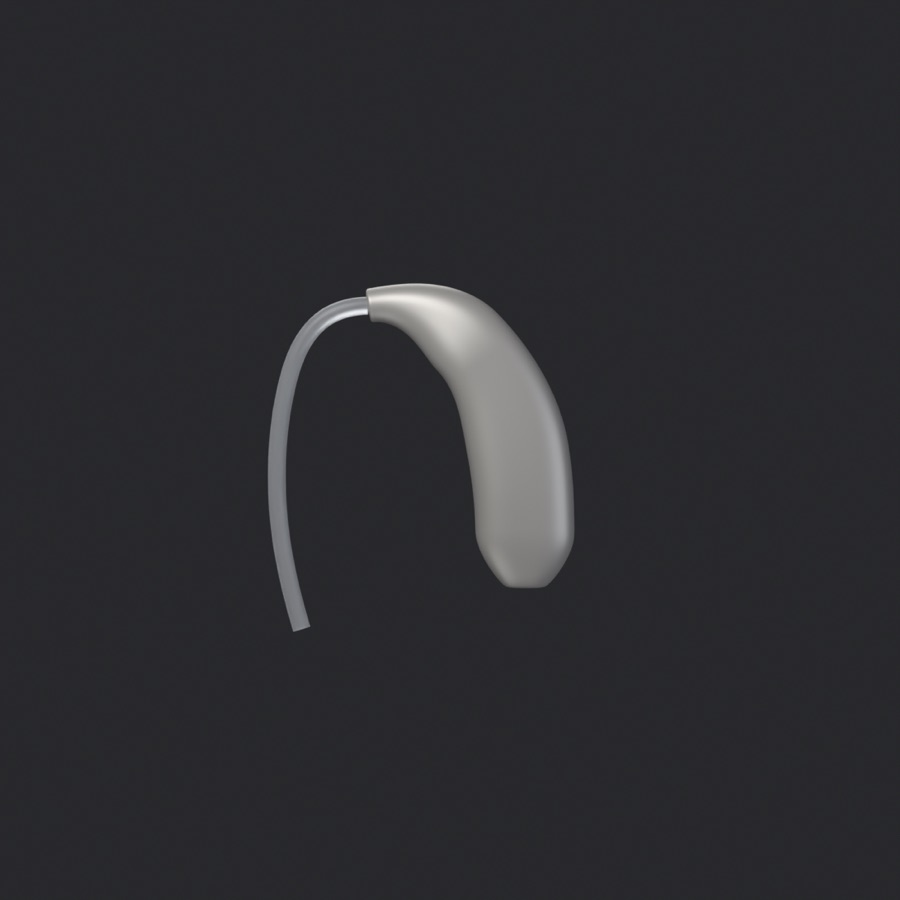
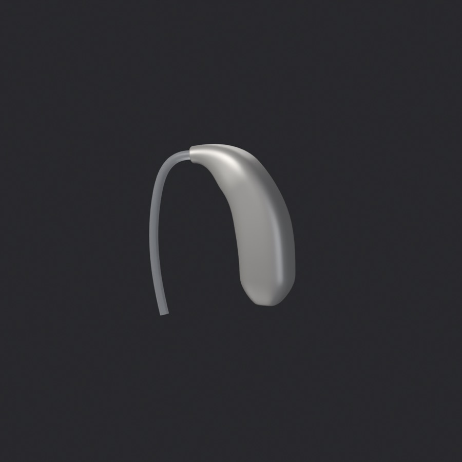
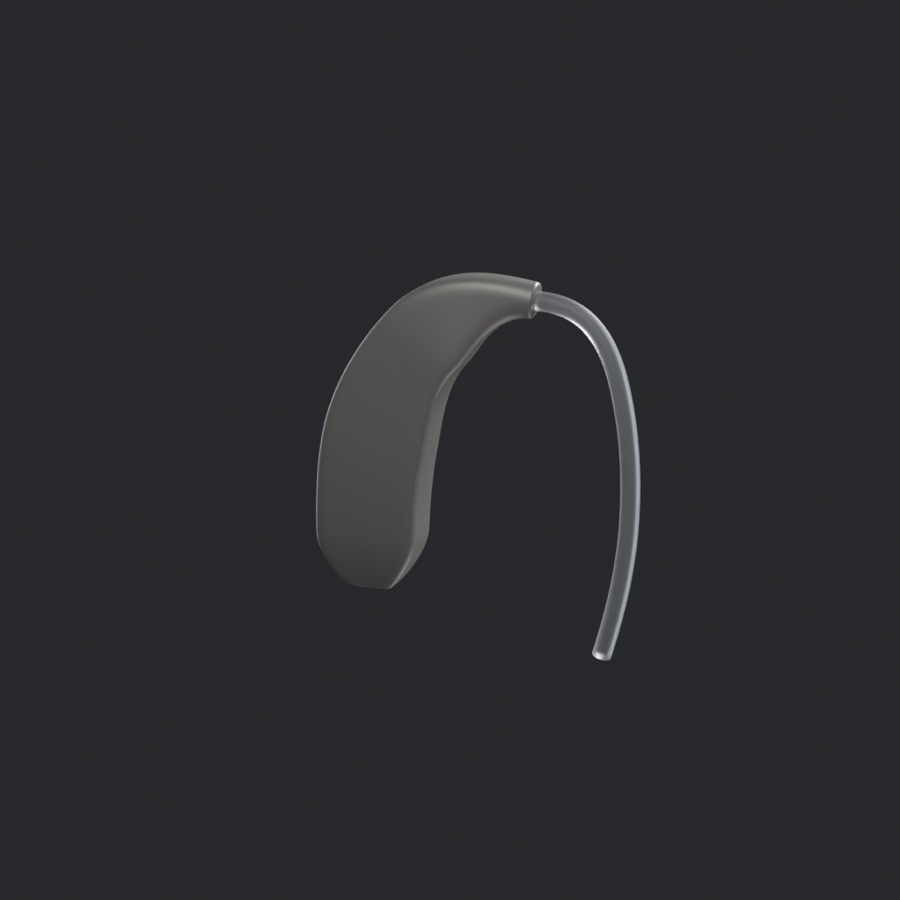
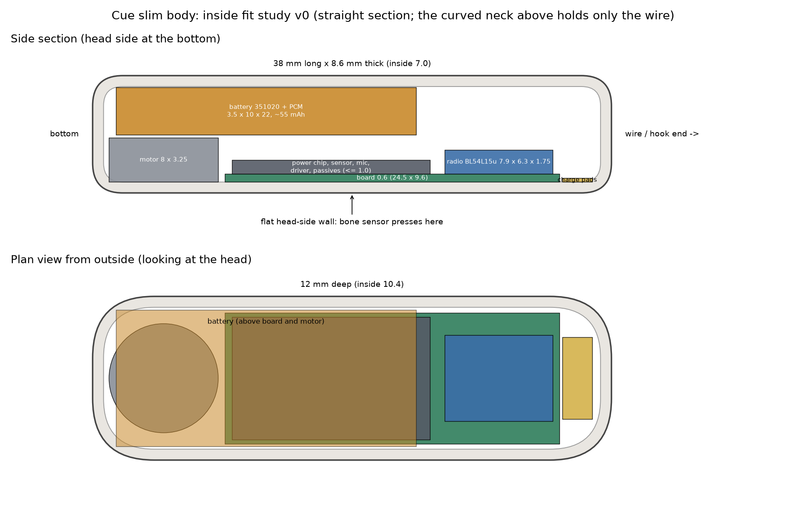

# Cue slim body: design direction

Status: direction agreed 2026-10-09. Concept shape approved; inside layout is a first fit study; needs a new board.

This is the product shape. The wearable **test mule** (`../DESIGN.md`) is a separate, bigger, pebble-shaped case
around the current 33 × 21 mm dev board, for proving the electronics. It was never going to look like this.

## The shape

  

Reference: a receiver-in-canal hearing aid as worn. A slim body tucked into the groove at the top-back of the ear,
mostly hidden by the ear, with a thin clear wire running over the ear. We're matching the **shape**, not its
controls. The reference photo isn't stored here because it's third-party.

- **Organic and elegant, not boxy.** The body arcs forward over the top of the ear and hangs straighter behind it.
- **Slim between two broad sides**, like a hearing aid. The cross-section is a soft rounded rectangle.
- **The head side is flat**, with soft edges. This is the face that presses on the skull for the bone sensor.
- **The top narrows and flows into a thin clear wire.** No chunky hook.
- Light satin finish (Cue's satin grey), frosted/clear wire.
- Concept sketch size: about 33 × 9 × 7.4 mm. The size that actually holds the parts is **about 38 × 12 × 8.6 mm**
  (see the fit study).

The renders are quick procedural sketches made with `concept_shapes.py` in Blender, variant `ric`. They aren't CAD.
The same script holds the earlier variants (crescent, pebble, leaf, aid).

Lesson for the CAD: define the body from its curves first (a curved spine, a tapering section, a flat head side),
then fit the parts inside. Building a box around the board and rounding it afterwards doesn't get there.

## Staying on, with nothing in the ear

A hearing aid is anchored by its earpiece in the ear canal. Cue has nothing in the ear, so the wire does the work.
`../sim/retention_groove.py` compares the options (300 worlds × 4,000 wearers; estimated physics, so it ranks
options and doesn't predict real numbers).

| Option                                  | Success, median (10–90%) | Stays on | Bone contact | Comfort |
| --------------------------------------- | ------------------------ | -------- | ------------ | ------- |
| **Wrap wire + light squeeze (0.3 N)**   | **69%** (42–86%)         | 100%     | 98%          | 82%     |
| Wrap wire + light squeeze + concha lock | 63%                      | 100%     | 98%          | 73%     |
| Wrap wire + firmer squeeze (0.6 N)      | 24%                      | 100%     | 100%         | 26%     |
| Thin wire over the ear only             | 8%                       | 100%     | 9%           | 100%    |

- **Staying on is easy** at 4–6 g in the groove: the ear itself holds the body.
- **Bone contact is the hard part.** A plain wire leaves the body loose and the bone sensor rarely touches well.
- **Design:**
  - a thin springy wire (1 mm nitinol in a slim clear sleeve), shaped to wrap the ear root: over the top and partway
    down the front
  - a **light squeeze of about 0.2–0.3 N** (about 25 g on a luggage scale)
  - a soft flattened saddle, 3–4 mm wide, where the wire rests on top of the ear
  - sizes S/M/L, swappable
- More squeeze hurts quickly, because a thin wire concentrates pressure on the ear root.
- A concha lock (a soft tail in the ear bowl) isn't needed. It could be an optional accessory for sport.

## Will the electronics fit? (fit study v0)

Drawn to scale by `fit_study.py`. Outer body 38 × 12 × 8.6 mm, 0.8 mm walls, inside 36.4 × 10.4 × 7.0 mm.

| Part                                          | Size (mm)                   | Fit                                                   |
| --------------------------------------------- | --------------------------- | ----------------------------------------------------- |
| Battery: 351020 LiPo with protection          | 3.5 × 10 × 22, about 55 mAh | 0.2 mm each side in depth: **very tight**             |
| Vibration motor (Vybronics VG0832)            | Ø8 × 3.25                   | Under the battery end: 6.95 of 7.0 mm: **very tight** |
| Board                                         | 0.6 thick, about 24.5 × 9.6 | Against the flat head-side wall                       |
| Power chip, motion sensor, mic, haptic driver | Up to 1.0 tall              | Under the battery; 1.9 mm spare above the stack       |
| Radio: Ezurio BL54L15µ (chip antenna)         | 7.9 × 6.3 × 1.75            | Past the battery, toward the wire end                 |
| Charging                                      | Contact pads                | **No USB-C**: the port is 9 mm wide                   |

What this means for the hardware:

1. **A new board**: narrow (about 9.6 mm), about 24.5 mm long, thin, low parts under the battery, the radio at one
   end. It uses the smaller BL54L15µ module, as the original cuff plan did (`../../rev0/`). That module was out of
   stock until about Dec 2026.
2. **A smaller battery**: about 55 mAh instead of 100 mAh, so shorter running time. Measure Cue's real current draw
   on the dev board to know how long it lasts.
3. **Charging by contacts** and a cradle or case, like the rev 0 plan ("pogo-pin charging, no connectors").
4. **No debug header, no battery connector**: test pads and a soldered cell.
5. **It's tight.** Two spots have almost no margin: the battery's depth and the motor under the battery. Options:
   - a thinner cell: 301020, 3 mm, about 40 mAh
   - a body 0.5–1 mm deeper and thicker
   - a smaller motor
6. **The flat board can't follow the curve.** It sits in the straighter lower part. The curved neck holds only the
   wire.

## Open questions

1. **Does bone conduction work in the groove?** On the mastoid the sensor presses on a broad flat bone. In the
   groove the contact patch is smaller and partly on the ear's root. Test with the kit or the mule held there,
   before laying out a new board.
2. **Running time** with a 40–55 mAh cell.
3. **Exact size**: hearing-aid size (33 × 9 × 7.4 mm) can't hold a 10 mm-wide cell or the 8 mm motor. The study
   uses 38 × 12 × 8.6 mm.
4. **Charging contacts**: where they go, and the cradle.
5. **Antenna**: the BL54L15µ's chip antenna sits next to the head and under the ear. Check range.
6. **Wear detection and buttons**: where the wear pad and a power button go on this body.
7. **Glasses**: body and wire share the groove with glasses arms.

## Next steps

1. Bench-test bone conduction in the groove (question 1).
2. Agree the outer size; then freeze the board outline and part positions as a brief for the board layout.
3. Build the body in Zoo from its curves (spine, section, flat head side), then cut the inside to the fit study.
4. Make wire sizes S/M/L and tune the squeeze to about 25 g.

## Files

- `concept_shapes.py`: the Blender concept sketches.
  `Blender --background --python concept_shapes.py -- ric out.png side` (views: side, worn, head, hero, edge).
- `fit_study.py`: the to-scale fit drawing (matplotlib).
- `../sim/retention_groove.py`: the retention Monte Carlo for this body (numpy).
- `../sim/fitcheck.py`: mesh fit checker used on the test mule's Zoo exports
  (`fitcheck.py board.stl base.stl cover.stl`; needs trimesh, scipy, rtree).
