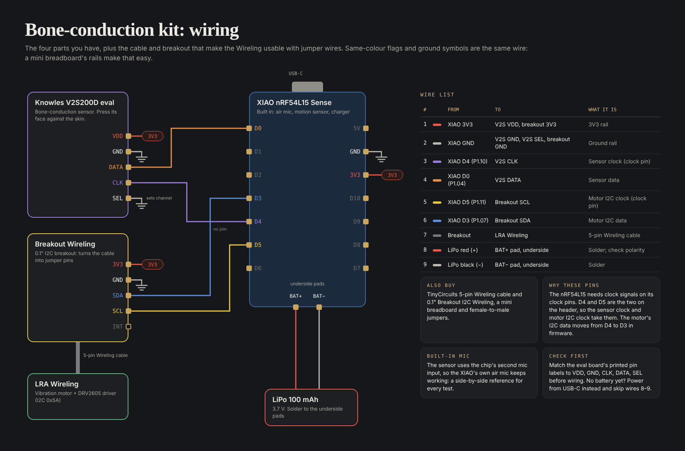

# Bone-conduction kit wiring

How to wire the off-the-shelf parts we have to test bone conduction before the custom board exists.

## Parts

Links checked Oct 4, 2026.

| Part                                                                                                      | Buy                                                                                                                                                                                | Price      |
| --------------------------------------------------------------------------------------------------------- | ---------------------------------------------------------------------------------------------------------------------------------------------------------------------------------- | ---------- |
| Seeed Studio XIAO nRF54L15 Sense                                                                          | [OpenELAB](https://openelab.com/products/seeed-studio-xiao-nrf54l15-sense) (or search seeedstudio.com) · [wiki](https://wiki.seeedstudio.com/xiao_nrf54l15_sense_getting_started/) | ~$16       |
| Knowles/Syntiant V2S200D eval board, KAS-700-0177 (bone-conduction sensor, face pressed against the skin) | [Digi-Key](https://www.digikey.com/en/products/detail/syntiant/KAS-700-0177/18670178)                                                                                              |            |
| TinyCircuits LRA Wireling (vibration motor + DRV2605 driver, I2C 0x5A)                                    | [TinyCircuits](https://tinycircuits.com/products/lra-wireling-drv2605)                                                                                                             | $14.95     |
| TinyCircuits 0.1" Breakout I2C Wireling                                                                   | [TinyCircuits](https://tinycircuits.com/products/0-1-breakout-i2c-wireling)                                                                                                        | $2.95      |
| TinyCircuits 5-pin Wireling cable                                                                         | [TinyCircuits](https://tinycircuits.com/products/5-pin-extension-cable)                                                                                                            | from $0.99 |
| Adafruit 3.7 V 100 mAh LiPo (#1570, JST-PH plug)                                                          | [Adafruit](https://www.adafruit.com/product/1570)                                                                                                                                  | $5.95      |
| Mini breadboard                                                                                           | [SparkFun](https://www.sparkfun.com/breadboard-mini-modular-blue.html)                                                                                                             | $4.60      |
| Female-to-male jumper wires                                                                               | [Adafruit #1954](https://www.adafruit.com/product/1954)                                                                                                                            | $1.95      |

The bare sensor chips for the custom board are in [`../rev0/SENSORS.md`](../rev0/SENSORS.md).

## Wire list

| #   | From            | To                             | What it is                  |
| --- | --------------- | ------------------------------ | --------------------------- |
| 1   | XIAO 3V3        | V2S VDD, breakout 3V3          | 3V3 rail                    |
| 2   | XIAO GND        | V2S GND, V2S SEL, breakout GND | Ground rail                 |
| 3   | XIAO D0 (P1.04) | V2S CLK                        | Sensor clock (clock pin)    |
| 4   | XIAO D4 (P1.10) | V2S DATA                       | Sensor data                 |
| 5   | XIAO D5 (P1.11) | Breakout SCL                   | Motor I2C clock (clock pin) |
| 6   | XIAO D3 (P1.07) | Breakout SDA                   | Motor I2C data              |
| 7   | Breakout        | LRA Wireling                   | 5-pin Wireling cable        |
| 8   | LiPo red (+)    | BAT+ pad, underside            | Solder; check polarity      |
| 9   | LiPo black (−)  | BAT− pad, underside            | Solder                      |

## Notes

- **Why these pins:** the nRF54L15 needs clock signals on its clock pins (P1.03, P1.04, P1.08, P1.11, P1.12 per the
  nRF54L15 pin table). D0 (P1.04) and D5 (P1.11) are the two on the header, so the sensor clock and the motor I2C
  clock take them. The motor's I2C data moves from D4 to D3 in firmware.
- **Built-in mic still works:** the sensor uses the chip's second mic input (PDM21), so the XIAO's own air mic stays
  available as a side-by-side reference.
- **Check first:** match the eval board's printed pin labels to VDD, GND, CLK, DATA, SEL before wiring. No battery yet?
  Power from USB-C and skip wires 8–9.
- Firmware (Zephyr / nRF Connect SDK) is not written yet.

## Files

- `kit_wiring.png`: the diagram.
- `kit_wiring.py`: generates `kit_wiring.html` (the same diagram as a page). Run `python3 kit_wiring.py`.
